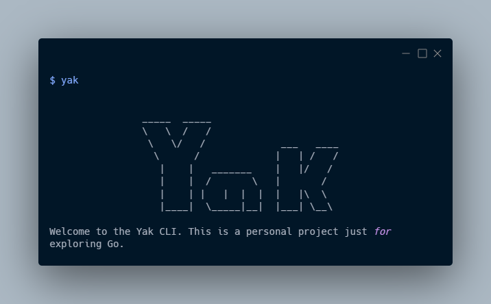

# yak
A minimal CLI


### How to Run
Clone the repo
```bash
git clone https://github.com/duckyoshie/yak.git
```
Go to your terminal/shell and type in yak



### Contribute
Please contribute to make yak an official CLI - with a little bit of everything.
To contribute - mention me - @duckyoshie - in discussions.

Icon made by [Flat Icons](https://www.flaticon.com/authors/flat-icons) from www.flaticon.com
